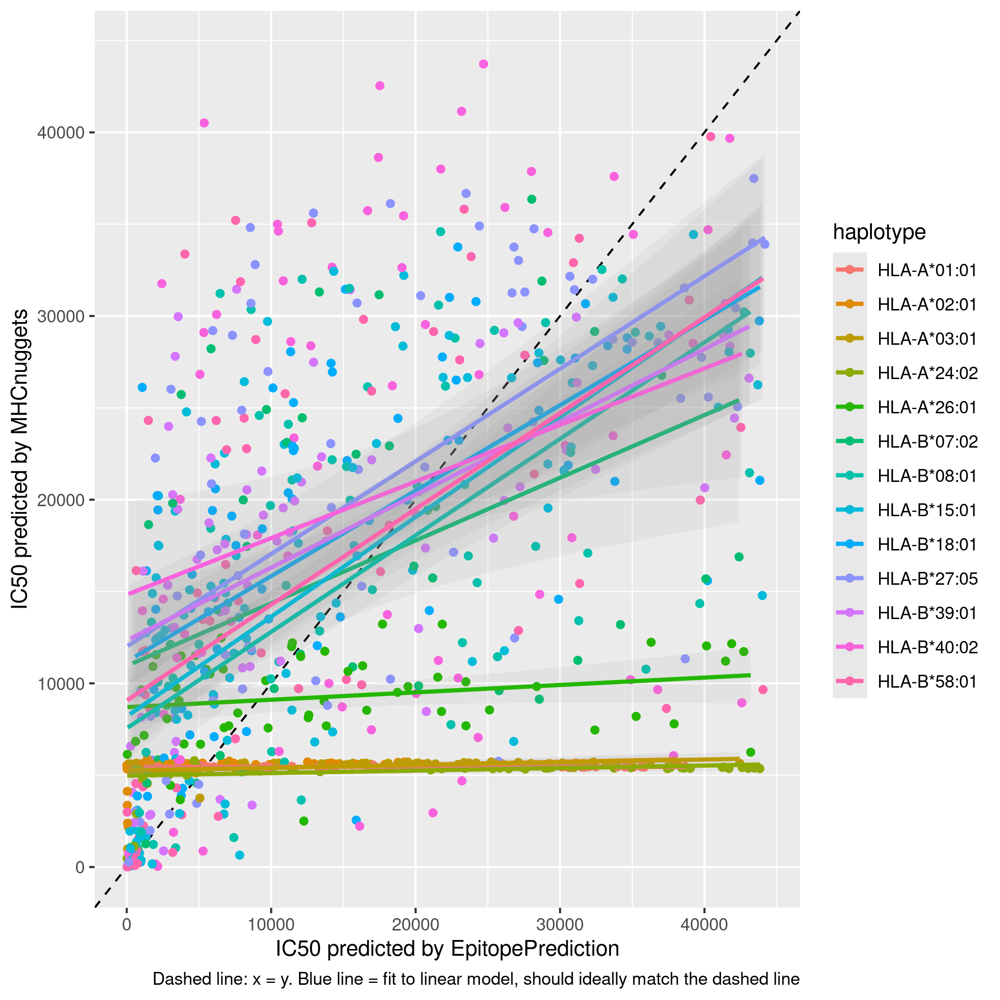
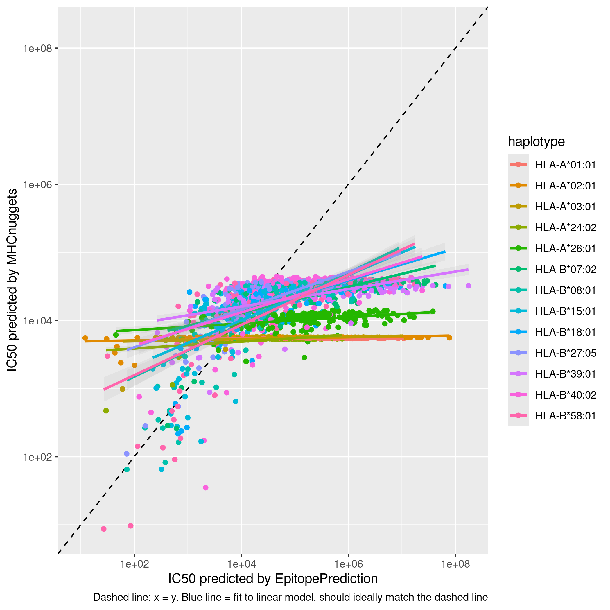
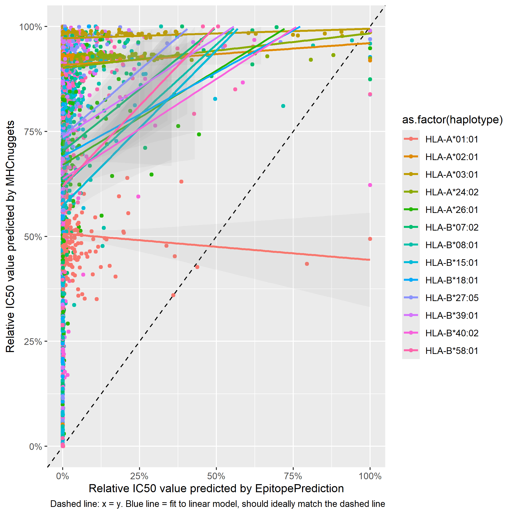
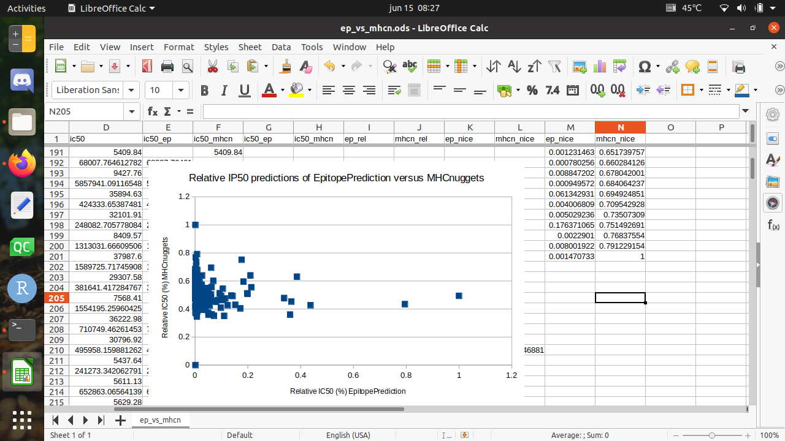

# ep_vs_mhcn

Branch   |                                                                             
---------|------------------------------------------------------------------------------------------------------------------------------------------
`master` | 
`develop`|

Compare the results of EpitopePrediction with those of MHCnuggets.

## IC50s 

There can be differences in how IC50s values are determined:

## Relative binding strength

The relative bindings strengths, however, should match:

Reproduced for HLA-A*01:01 only (the red line),
gives the same unexpected result:

